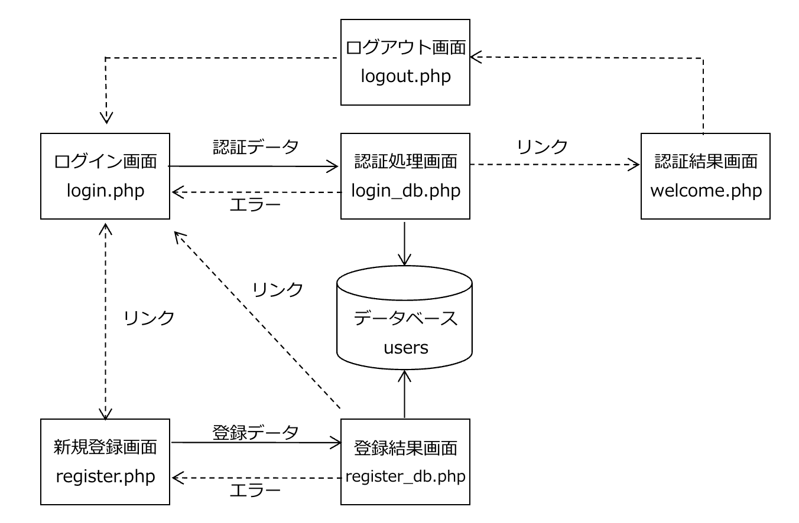
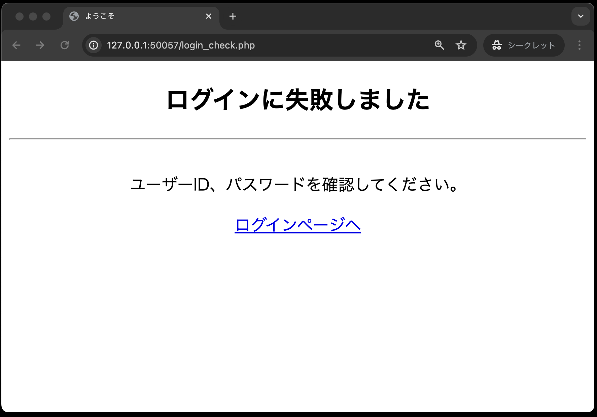
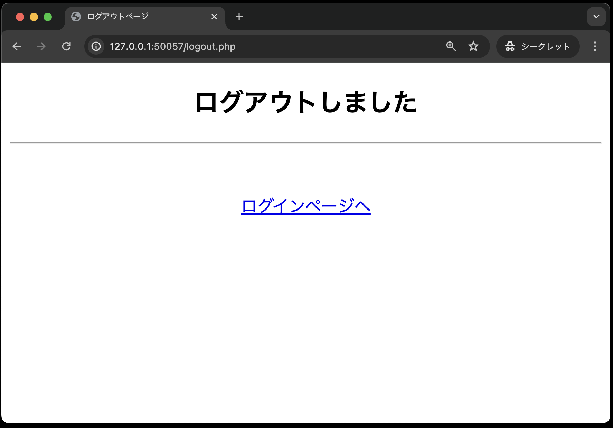

# ログイン認証①

[こちらのページ]()から、ソースコードを`C:¥web_app_dev`へcloneしてください。

## Webアプリケーション「ログイン認証」を作成

今回作成するWebアプリケーションでは、以下のファイルを作成します。
それぞれのファイル名と主な機能は以下のとおりです。

| ファイル名 | 主な機能 |
| - | - |
|register.html|新規ユーザー登録を行うため、ユーザーID、パスワード、氏名を入力する画面|
|register.php|新規ユーザの登録処理結果を表示する画面|
|login.html|ユーザーID、パスワードを入力する画面|
|login_check.php|認証処理をする画面|
|welcome.php|ログイン認証が完了した場合、ログインしたユーザー名を表示する画面|
|logout.php|ログアウト処理を行う画面|
|dbdata.php|データベースの基本事項を定義する|
|user.php|認証処理や新規ユーザの登録を行う|
|util.php|画面共通で利用するエスケープ関数をまとめたファイル|
|login.css|各画面のデザイン用スタイルシート|

画面遷移は以下のとおり。
（`dbdata.php`, `user.php`, `util.php`, `login.css`は直接画面表示に関係ないので、下図では省略しています。）



## 詳細画面

1. 新規登録画面（register.html）<br>
新規ユーザーが、「ユーザーID」、「パスワード」、「名前」をデータベースに登録する入力フォームを用意する。<br>
<br><br>

1. 登録結果画面（register.php）<br>
ユーザー登録が完了した場合、登録した「ユーザーID」、「パスワード」、「名前」を画面に表示する。<br>
※実際のシステムでは、パスワードを見せることはせずに「\*\*\*\*\*」といった形で表示するが、ここではあえて見える形で表示している<br>
<br><br>
登録済みのユーザーIDを使った場合はエラーとし、入力されたユーザーIDを画面に表示する。<br>


1. ログイン画面（login.html）<br>
新規登録完了後、登録したユーザーIDとパスワードを入力する。<br>
<br><br>

1. 認証処理画面(login_check.php)<br>
入力したユーザーIDとパスワードが、データベースに登録した内容と一致した場合、ログインを認め、認証結果画面(welcome.php)に遷移する。<br>
登録されていないユーザーIDやパスワードでログインしようとした場合には、次のエラー画面を表示する。<br>
<br>

1. 認証結果画面(welcome.php)<br>
入力したユーザーIDとパスワードが、データベースに登録した内容と一致した場合、ログインを認め、「○○○○ さんログイン中」とログインしたユーザー名を表示する。<br>
<br><br>
なお、認証をしていない状態で直接URLを入力した場合は、ログイン画面に遷移する。<br>

1. ログアウト画面（logout.php）<br>
ログアウトボタンを押すと、ログアウト処理をしたことを表示する。<br>
<br><br>

## 本章で使用するテーブルについて

使用するテーブルは、以下の通りです。

**テーブル名：users**

| カラム名 | データ型 | 制約 |
| - | - | - |
|userId|varchar型|最大文字数8、主キーとして設定、大文字・小文字を区別するためbinary属性を設定|
|password|varchar型|最大文字数12、not null制約|
|userName|varchar型|最大文字数50、not null制約|

## プログラムの作成

プログラムは、次の順番で作成します。

1. register.html・・・新規ユーザー登録を行うため、ユーザーID、パスワード、氏名を入力する画面
1. util.php・・・画面共通で利用するエスケープ関数をまとめたファイル
1. dbdata.php・・・データベースの基本事項を定義する
1. user.php(登録用メソッド追加)・・・認証処理や新規ユーザの登録を行う
1. register.php・・・新規ユーザの登録処理結果を表示する画面
1. login.html・・・ユーザーID、パスワードを入力する画面
1. user.php(認証用メソッド追加)・・・認証処理や新規ユーザの登録を行う
1. login_check.php・・・認証処理をする画面
1. welcome.php・・・ログイン認証が完了した場合、ログインしたユーザー名を表示する画面
1. logout.php・・・ログアウト処理を行う画面

なお、「login.css」を利用し画面デザインを適用するため、HTMLのタグに`id`や`class`といった属性を追加しています。

CSSについて初めての方は、以下のサイトなどで簡単な使い方などを参考に理解しておいてください。

[【初心者向け】CSSセレクタとは？セレクタの種類や指定方法を解説！（基礎編）](https://www.asobou.co.jp/blog/web/css-selectors)

### register.html

```php
<!DOCTYPE html>
<html lang="ja">

<head>
    <meta charset="UTF-8">
    <meta name="viewport" content="width=device-width, initial-scale=1.0">
    <title>新規登録ページ</title>
    <!-- スタイルシートlogin.css を利用する -->
    <link rel="stylesheet" href="css/login.css">
</head>

<body>
    <div id="main">
        <h2>新規ユーザー登録</h2>
        <hr><br>
        ユーザー情報を登録してください。
        <form method="POST" action="register.php">
            <table id="mainTable">
                <tr>
                    <th class="right-align">ユーザーID：</th>
                    <td class="left-align"><input type="text" name="userId" required></td>
                </tr>
                <tr>
                    <th class="right-align">パスワード：</th>
                    <td class="left-align"><input type="password" name="password" required></td>
                </tr>
                <tr>
                    <th class="right-align">お名前：</th>
                    <td class="left-align"><input type="text" name="userName" required></td>
                </tr>
                <tr>
                    <th class="right-align">&nbsp;</th>
                    <td class="left-align"><input type="submit" value="登録する"></td>
                </tr>
            </table>
        </form>
        <p><a href="login.html">ログインページへ</a></p>
    </div>
</body>

</html>
```

コードが作成できたら、ブラウザでの表示確認をしてください。


なお、今回はhtmlの `<input>`タグに `required` 属性をつけているので、入力をしないまま「登録する」をクリックすると、未入力チェックメッセージが表示されます。


### util.php

[関数](../function/README.md)で紹介したエスケープ処理用関数をまとめたファイルです。

```php
<?php
// 画面表示データのエスケープ処理用関数
function h($data)
{
    return htmlspecialchars($data, ENT_QUOTES, "UTF-8");
}
```

## classes/dbdata.php

データベースの基本事項に関するクラスが定義されているクラスです。
前章の[オブジェクト指向プログラミング①](../object-i/README.md)のときとほぼ同じですが、今回は`exec`メソッドの戻り値を判定に利用するため、その部分を追記しています。

なお、dbdata.phpのファイルは、`public`内に`classes`というディレクトリを作成し、そこに追加してください。

```php
<?php
// DbDataクラスの宣言
class DbData
{
    // PDOオブジェクト用のプロパティ(メンバ変数)の宣言
    protected $pdo;

    // コンストラクタ
    // 「__construct」の「̲̲__」は「_(アンダースコア)」を2つ記述する
    public function __construct()
    {
        // PDOオブジェクトを生成する
        $user = 'sampleuser';
        $password = 'samplepass';
        $host = 'db';
        $dbName = 'SAMPLE';
        $dsn = 'mysql:host=' . $host . ';dbname=' . $dbName . ';charset=utf8';
        try {
            $this->pdo = new PDO($dsn, $user, $password);
        } catch (Exception $e) {
            // 接続できなかった場合のエラーメッセージ
            exit('データベースに接続できませんでした：' . $e->getMessage());
        }
    }

    // SELECT文実行用のqueryメソッド ・・・このメソッドはユーザー定義関数
    protected function query($sql, $array_params)
    {
        $stmt = $this->pdo->prepare($sql);
        $stmt->execute($array_params);
        // PDOステートメントオブジェクトを返すので
        // 呼び出し側でfetch( )、またはfetchAll( )で結果セットを取得
        return $stmt;
    }

    // INSERT、UPDATE、DELETE文実行用のメソッド ・・・このメソッドもユーザー定義関数
    protected function exec($sql, $array_params)
    {
        $stmt = $this->pdo->prepare($sql);
        // 成功:true、失敗:false
        $stmt->execute($array_params);
        // 【今回追記】実行結果(true or false)を利用するので、戻り値を返す
        return $stmt;
    }
}
```

## classes/user.php

次に、クラス`DbData`を継承する、クラス`User`を定義するPHPファイル「user.php」 を作成します。
まずクラス`User`に、新規ユーザー登録処理を行う`signUp`メソッドを追加します。

なお、dbdata.php同様、user.phpも`public`内の`classes`というディレクトリに作成してください。

**一部のソースコードが穴埋めになっている**ので、それぞれの箇所に適切なコードを追記してください。
なお、穴埋めが必要な箇所のコメントに **(穴埋め)** と記載しています。

```php
<?php
// スーパークラスであるDbDataを利用するため、dbdata.phpを読み込む(穴埋め)
require_once 

// DbDataクラスを継承するUserクラスの定義(穴埋め)
class 
{
    // ユーザー登録処理
    public function signUp($userId, $password, $userName)
    {
        // userIdを条件とするSELECT文の定義(穴埋め)
        $sql = 
        // dbdata.phpのqueryメソッドの実行(穴埋め)
        $stmt = 
        // 抽出したデータを取り出す(穴埋め)
        $result = 
        // 登録しようとしているユーザーID（Eメール）が既に登録されている場合
        if ($result) { // ①
            return 'ユーザーID「' . $userId . '」は既に登録されています。<br>他のユーザーIDをご利用ください。';
        }
        // 登録しようとしているユーザーIDが未登録の場合
        // ユーザーを登録するINSERT文の定義(穴埋め)
        $sql = 
        // dbdata.phpのexecメソッドの実行(穴埋め)
        $result = 
        // 登録が成功した場合
        if ($result) {
            // ここも空文字を返すので「''」はシングルクォーテーションが２つ
            return '';
        // 登録に失敗した場合
        } else {
            // 何らかの原因で失敗した場合
            return '新規登録できませんでした。管理者にお問い合わせください。';
        }
    }
}
```

①`if ($result) { `: `$result`には`signUp`メソッドの戻り値が格納されます。`signUp`の戻り値は、`fetch`メソッドの戻り値になります。

`fetch`メソッドの戻り値をif分の条件に使うと、データが取得できた場合は`true`、取得できなかった場合は`false`になります。

## register.php

**一部のソースコードが穴埋めになっている**ので、それぞれの箇所に適切なコードを追記してください。
なお、穴埋めが必要な箇所のコメントに **(穴埋め)** と記載しています。

```php
<?php
// 送られてきたデータを受けとる(穴埋め)
$userId   = 
$password = 
$userName = 

// Userクラスを利用するため、user.phpクラスを読み込む(穴埋め)
require_once
// Userオブジェクトを生成する(穴埋め)
$user = 
// ユーザー登録処理を行うsignUpメソッドを呼び出し、その結果のメッセージを受け取る((穴埋め)
$result = 

// 共通するデータ・関数を定義したPHPファイルを読み込む
require_once  __DIR__  .  '/util.php';
?>

<!DOCTYPE html>
<html lang="ja">

<head>
    <meta charset="UTF-8">
    <meta name="viewport" content="width=device-width, initial-scale=1.0">
    <title>新規登録ページ</title>
    <link rel="stylesheet" href="css/login.css">
</head>

<body>
    <div id="main">
        <?php

        // エラーがなく、正しく登録された場合
        if ($result === '') {
        ?>
            <h2>ユーザー登録が完了しました</h2>
            <hr><br>
            <table id='regiTable'>
                <tr>
                    <th>ユーザーID</th>
                    <td><?= h($userId) ?></td> <!-- ① -->
                </tr>
                <tr>
                    <th>パスワード</th>
                    <td><?= h($password) ?></td>
                </tr>
                <tr>
                    <th>お名前</th>
                    <td><?= h($userName) ?></td>
                </tr>
            </table>
            <p><a href='login.html'>ログインページへ</a></p>
        <?php
        // 登録に失敗した場合
        } else {
        ?>
            <h2>登録に失敗しました</h2>
            <hr><br>
            <?= $result ?>
            <p><a href='register.html'>新規ユーザー登録へ戻る</a></p>
        <?php
        }
        ?>
    </div>
</body>

</html>
```

①: `<?=  ?>` は、`<?php echo ?>`の省略形であり、htmlの中に部分的にPHPの変数を埋め込みたい時に便利な書き方です。
また、`h($userId)` は、`util.php` で定義したエスケープ処理用関数です。

完成させた後、ブラウザで「register.html」を表示し、以下のデータを入力後「登録する」ボタンを押し、無事に登録されたことを確認してください。

- ユーザーID: kobe
- パスワード: denshi
- お名前: 神戸電子


また、もう一度「register.html」で同じユーザーを登録しようとすると、以下のように登録が失敗することも確認してください。


**次回「ログイン認証②」に続きます。まだpushはしないでください。**

# ログイン認証②

前回のログイン認証①まで作成していれば、以下のファイル構成となっているはずです。

```text
public
├── classes
│   ├── dbdata.php
│   └── user.php
├── index.php
├── register.html
├── register.php
└── util.php
```

それでは、引き続きログイン認証のプログラムを実装していきましょう！

### login.html

```php
<!DOCTYPE html>
<html lang="ja">

<head>
    <meta charset="UTF-8">
    <meta name="viewport" content="width=device-width, initial-scale=1.0">
    <title>ログインページ</title>
    <link rel="stylesheet" href="css/login.css">
</head>

<body>
    <div id="main">
        <h2>ログインページ</h2>
        <hr><br>
        ログインしてください。初めての方は「新規ユーザー登録」をしてください。
        <form method="POST" action="login_check.php">
            <table id="mainTable">
                <tr>
                    <th class="right-align">ユーザーID：</th>
                    <td class="left-align"><input type="text" name="userId" required></td>
                </tr>
                <tr>
                    <th class="right-align">パスワード：</th>
                    <td class="left-align"><input type="password" name="password" required></td>
                </tr>
                <tr>
                    <th>&nbsp;</th>
                    <td class="left-align"><input type="submit" value="ログイン"></td>
                </tr>
            </table>
        </form>
        <p><a href="register.html">新規登録はこちらから</a></p>
    </div>
</body>

</html>
```

入力が終わったら、必ずブラウザで以下のように正しく表示されるかを確認してください。


### classes/user.php

前回は、クラス`User`に、新規ユーザー登録処理を行う`signUp`メソッドを追加しました。
今回は、ログイン認証処理を行う`authUser`メソッドを追加します。

ログイン認証を行うためには、ユーザーIDとパスワードを条件に、ユーザー情報を取得する必要があります。

**一部のソースコードが穴埋めになっている**ので、それぞれの箇所に適切なコードを追記してください。

```php
// ---前の章で作成したコード(ここから)---
<?php
// スーパークラスであるDbDataを利用するため、dbdata.phpを読み込む(穴埋め)
require_once 

// DbDataクラスを継承するUserクラスの定義(穴埋め)
class 
{
    // ユーザー登録処理
    public function signUp($userId, $password, $userName)
    {
        // userIdを条件とするSELECT文の定義(穴埋め)
        $sql = 
        // dbdata.phpのqueryメソッドの実行(穴埋め)
        $stmt = 
        // 抽出したデータを取り出す(穴埋め)
        $result = 
        // 登録しようとしているユーザーID（Eメール）が既に登録されている場合
        if ($result) {
            return 'ユーザーID「' . $userId . '」は既に登録されています。<br>他のユーザーIDをご利用ください。';
        }
        // 登録しようとしているユーザーIDが未登録の場合
        // ユーザーを登録するINSERT文の定義(穴埋め)
        $sql = 
        // dbdata.phpのexecメソッドの実行(穴埋め)
        $result = 
        // 登録が成功した場合
        if ($result) {
            // ここも空文字を返すので「''」はシングルクォーテーションが２つ
            return '';
        // 登録に失敗した場合
        } else {
            // 何らかの原因で失敗した場合
            return '新規登録できませんでした。管理者にお問い合わせください。';
        }
    }
    // ---前の章で作成したコード(ここまで)---

    // --- ここから追加 ---

    // ログイン認証処理
    public function authUser($userId, $password)
    {
        // SQL文を定義(穴埋め)
        // ※ヒント:ユーザーIDとパスワードを条件にユーザー情報を取得
        $sql = 
        // DbDataクラスのqueryメソッドを呼び出す
        $stmt = $this->query($sql, [$userId, $password]);
        // fetchメソッドでデータを取り出す(穴埋め)
        return 
    }

    // --- ここまで追加 ---
}

```

## login_check.php

まずは、認証処理画面(login_check.php)にて、ログインに成功した際、セッションに認証情報を保存します。

なお、**一部穴埋めになっている**ので、それぞれの箇所に適切なコードを追記してください。

```php
<?php
// 送られてきたユーザーIDとパスワードを受け取る(穴埋め)
$userId   = 
$password = 

// Userクラスを利用するため、user.phpを読み込む(穴埋め)
require_once 
// UserクラスからUserオブジェクトを生成する(穴埋め)
$user =  
// authUserメソッドを呼び出し、認証結果を受け取る(穴埋め)
$result = 

// ログインに成功した場合、welcome.phpにリダイレクトする
if ($result) {  // ①
    // セッションを開始(穴埋め)
    
    // セッションにユーザー名を保存
    $_SESSION['userName'] = $result['userName'];
    header('Location: welcome.php');
    exit();
}

// 共通するデータ・関数を定義したPHPファイルを読み込む
require_once  __DIR__  .  '/util.php';
?>

<!DOCTYPE html>
<html lang="ja">

<head>
    <meta charset="UTF-8">
    <meta name="viewport" content="width=device-width, initial-scale=1.0">
    <title>ログインページ</title>
    <link rel="stylesheet" href="css/login.css">
</head>

<!-- ログインに失敗した場合のメッセージを表示する -->

<body>
    <div id="main">
        <h2>ログインに失敗しました</h2>
        <hr><br>
        ユーザーID、パスワードを確認してください。
        <p><a href='login.html'>ログインページへ</a></p>
    </div>
</body>

</html>
```

①`if ($result) { `: `$result`には`authUser`メソッドの戻り値が格納されます。
`authUser`の戻り値は、`fetch()`メソッドの戻り値になります。

`fetch()`メソッドの戻り値をif分の条件に使うと、データが取得できた場合は`true`、取得できなかった場合は`false`になります。

## welcome.php

ログイン認証に成功し、ユーザーがログインしていることを表示する画面です。

なお、**一部穴埋めになっている**ので、それぞれの箇所に適切なコードを追記してください。

```php
<?php
// セッションを開始(穴埋め)

// 共通するデータ・関数を定義したPHPファイルを読み込む
require_once  __DIR__  .  '/util.php';
?>

<!DOCTYPE html>
<html lang="ja">

<head>
    <meta charset="UTF-8">
    <meta name="viewport" content="width=device-width, initial-scale=1.0">
    <title>ログインページ</title>
    <link rel="stylesheet" href="css/login.css">
</head>

<body>
    <div id="main">
        <h2>ようこそ！</h2>
        <hr><br>
        <!-- セッションに保存されたユーザー名を表示する(穴埋め) -->
        <?= h(                 ) ?>さんログイン中
        <p><a href='logout.php'>ログアウト</a></p>
    </div>
</body>

</html>
```

完成させた後、ブラウザで「login.html」を表示し、次のデータを入力後「ログイン」ボタンを押し、認証できることを確認してください。

- ユーザーID: kobe
- パスワード: denshi


また、登録していないユーザーを「login.html」に入力すると、以下のように認証が失敗することを確認してください。


# ログイン認証③

ログイン認証②まで作成していれば、以下のファイル構成となっているはずです。

```text
public
├── classes
│   ├── dbdata.php
│   └── user.php
├── index.php
├── login_check.php
├── login.html
├── register.html
├── register.php
├── util.php
└── welcome.php
```

それでは、引き続きログイン認証のプログラムを実装していきましょう！

## logout.php

ログアウト処理を行う`logout.php`を作成します。

なお、**一部穴埋めになっている**ので、それぞれの箇所に適切なコードを追記してください

```php
<?php
// セッションを開始(穴埋め)

// $_SESSIONの中身を空にする
$_SESSION = array();
// クッキーの中にセッションIDがある場合、クッキーの中身を空にする
// session_name()は、セッションIDが入っているクッキーの名前を取得する関数
if (isset($_COOKIE[session_name()]) == true) {  // ①
    setcookie(session_name(), '', time() - 10, '/');
}
// セッションに 関連づけられた全てのデータを破棄する(破棄タイミングは、PHPスクリプトが実行された後)
session_destroy();
?>

<!DOCTYPE html>
<html lang="ja">

<head>
    <meta charset="UTF-8">
    <meta name="viewport" content="width=device-width, initial-scale=1.0">
    <title>ログアウトページ</title>
    <link rel="stylesheet" href="css/login.css">
</head>

<body>
    <div id="main">
        <h2>ログアウトしました</h2>
        <hr><br>
        <p><a href="login.html">ログインページへ</a></p>
    </div>
</body>
```

## これでログイン認証作成完了！！...ではありません

このままですと、実はログインしていなくても、直接URLを入力することで認証結果画面(welcome.php)にアクセスすることができてしまいます...(もちろん、正しい画面遷移ではないのでエラーが出ます)


このような不正アクセスを防ぐために、ログインしていない場合はログインページに遷移をするよう処理を追加します。

### login_check.php

まずは、認証処理画面(login_check.php)にて、ログインに成功した際、セッションに認証情報を保存します。

```php
<?php
// 送られてきたユーザーIDとパスワードを受け取る(穴埋め)
$userId   = 
$password = 

// Userクラスを利用するため、user.phpクラスを読み込む(穴埋め)
require_once 
// UserクラスからUserオブジェクトを生成する(穴埋め)
$user 
// authUserメソッドを呼び出し、認証結果を受け取る(穴埋め)
$result = 

// ログインに成功した場合、welcome.phpにリダイレクトする
if ($result) { 
    // セッションを開始(穴埋め)
    
    // --ここだけ追加--
    $_SESSION['login'] = 1;　// ログインフラグ
    // --ここまで--
    // セッションにユーザー名を保存
    $_SESSION['userName'] = $result['userName'];
    header('Location: welcome.php');
    exit();
}

// 共通するデータ・関数を定義したPHPファイルを読み込む
require_once  __DIR__  .  '/util.php';
?>

<!DOCTYPE html>
<html lang="ja">

<head>
    <meta charset="UTF-8">
    <meta name="viewport" content="width=device-width, initial-scale=1.0">
    <title>ログインページ</title>
    <link rel="stylesheet" href="css/login.css">
</head>

<!-- ログインに失敗した場合のメッセージを表示する -->

<body>
    <div id="main">
        <h2>ログインに失敗しました</h2>
        <hr><br>
        ユーザーID、パスワードを確認してください。
        <p><a href='login.html'>ログインページへ</a></p>
    </div>
</body>

</html>
```

### welcome.php

続いて、認証結果画面(welcome.php)にて、セッションに認証情報が無い場合に、ログイン画面にリダイレクトする処理を追加します。

```php
<?php
// セッションを開始(穴埋め)

// ----ここから追加----
if (isset($_SESSION['login']) == false) {
    header('Location: login.html');
    exit();
}
// ----ここまで追加----

// 共通するデータ・関数を定義したPHPファイルを読み込む
require_once  __DIR__  .  '/util.php';
?>

<!DOCTYPE html>
<html lang="ja">

<head>
    <meta charset="UTF-8">
    <meta name="viewport" content="width=device-width, initial-scale=1.0">
    <title>ログインページ</title>
    <link rel="stylesheet" href="css/login.css">
</head>

<body>
    <div id="main">
        <h2>ようこそ！</h2>
        <hr><br>
        <!-- セッションに保存されたユーザー名を表示する(穴埋め) -->
        <?= h(                 ) ?>さんログイン中
        <p><a href='logout.php'>ログアウト</a></p>
    </div>
</body>

</html>
```

以上で、修正は完了です。
実際の動作を確認してみましょう。

1. ログインしていない状態で、welcome.phpにアクセスしてください。<br>


2. ログインページにリダイレクトされることを確認してください。


これで本当にログイン認証の作成が完了しました。
お疲れ様でした。

## 課題の作成と提出

## 採点について

提出した課題はGitHub上で自動採点されます。
提出後、課題が合格しているかを確認してください。
合格していない場合は修正後pushし、再提出してください。

### 課題の合格基準

以下の3つを合格基準とします。

1. ユーザーが新規登録できること
2. 新規登録したユーザーでログインできること
3. ログインしていない状態で、welcome.phpにアクセスすると、ログインページにリダイレクトされること

### 合格確認方法

1. 本課題の[課題ページ](https://classroom.github.com/a/Z_5J2cM9)に再度アクセスします。
2. 画面上部にある`Actions`をクリックしてください。<br>

1. **一番上**の行に、緑色のチェックが入っていればOKです。<br>


