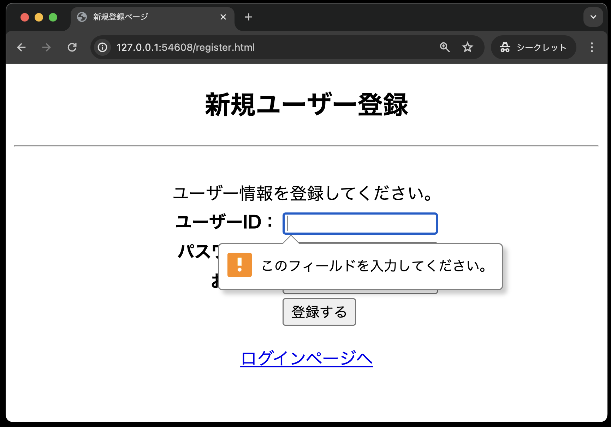

# ログイン認証(新規登録機能の実装)

まずは以下の5つを実装します。

1. `register.html`・・・新規ユーザー登録を行うため、ユーザーID、パスワード、氏名を入力する画面
2. `util.php`・・・画面共通で利用するエスケープ関数をまとめたファイル
3. `dbdata.php`・・・データベースの基本事項を定義する
4. `user.php`(登録用メソッド追加)・・・認証処理や新規ユーザの登録を行う
5. `register.php`・・・新規ユーザの登録処理結果を表示する画面

## 新規登録画面(register.html)

**register.html**

```php
<!DOCTYPE html>
<html lang="ja">

<head>
    <meta charset="UTF-8">
    <meta name="viewport" content="width=device-width, initial-scale=1.0">
    <title>新規登録ページ</title>
    <!-- スタイルシートlogin.css を利用する -->
    <link rel="stylesheet" href="css/login.css">
</head>

<body>
    <div id="main">
        <h2>新規ユーザー登録</h2>
        <hr><br>
        ユーザー情報を登録してください。
        <form method="POST" action="register.php">
            <table id="mainTable">
                <tr>
                    <th class="right-align">ユーザーID：</th>
                    <td class="left-align"><input type="text" name="userId" required></td>
                </tr>
                <tr>
                    <th class="right-align">パスワード：</th>
                    <td class="left-align"><input type="password" name="password" required></td>
                </tr>
                <tr>
                    <th class="right-align">お名前：</th>
                    <td class="left-align"><input type="text" name="userName" required></td>
                </tr>
                <tr>
                    <th class="right-align">&nbsp;</th>
                    <td class="left-align"><input type="submit" value="登録する"></td>
                </tr>
            </table>
        </form>
        <p><a href="login.html">ログインページへ</a></p>
    </div>
</body>

</html>
```

コードが作成できたら、ブラウザでの表示確認をしてください。


なお、今回はhtmlの `<input>`タグに `required` 属性をつけているので、入力をしないまま「登録する」をクリックすると、未入力チェックメッセージが表示されます。



## 画面共通部品(util.php)

ユーザー定義関数を使って、画面表示データのエスケープ処理を行う関数を定義します。

```php
<?php
// 画面表示データのエスケープ処理用関数
function h($data)
{
    return htmlspecialchars($data, ENT_QUOTES, "UTF-8");
}
```

**【解説】**

フォームから送られてきた値や、データベースから取り出した値をブラウザ上に表示する際に使用します。クロスサイトスクリプティングなど悪意のあるコードの埋め込みを防ぐことができます。(エスケープやサニタイズと呼ばれます)

構文:

```php
htmlspecialchars ( エスケープする文字列, エスケープの種類, 文字コード );
```

第1引数：エスケープする文字列は、ブラウザ上に表示する値を指定します。<br> 
第2引数：エスケープの種類はいくつかあるが、`ENT_QUOTES`を指定します。<br>
これにより次の文字が特殊文字（実態参照）に変換されます。

|変換前|変換後|
| - | - |
|& （アンパサンド）|`&amp;`|
|" （ダブルクォート）|`&quot;`|
|' （シングルクォート）|`&#039;`または `&apos;`|
|< （小なり）|`&lt;`|
|> （大なり）|`&gt;`|

第3引数：文字コードは「UTF-8」を指定します。

【使用例】

```php
<?php

$new = "<a href='test'>Test</a>";
echo htmlspecialchars ( $new,  ENT_QUOTES,  "UTF-8");

?>
```

`<a href='test'>Test</a>` が `&lt;a href=&#039;test &#039;&gt;Test&lt;/a &gt;` に変換されますが、ブラウザには `<a href='test'>Test</a>` と表示されます。

## DbDataクラスの作成

データベースの基本事項に関するクラスが定義されているクラスです。
前章の[オブジェクト指向]([../object-i/README.md](https://2025web1.github.io/08-object/dbdata.html#dbdata%E3%82%AF%E3%83%A9%E3%82%B9))のときとほぼ同じですが、今回は`exec`メソッドの戻り値を判定に利用するため、その部分を追記しています。

なお、`dbdata.php`のファイルは、`public`内に`classes`というディレクトリを作成し、そこに追加してください。

**classes/dbdata.php**

```php
<?php
// DbDataクラスの宣言
class DbData
{
    // PDOオブジェクト用のプロパティ(メンバ変数)の宣言
    protected $pdo;

    // コンストラクタ
    // 「__construct」の「̲̲__」は「_(アンダースコア)」を2つ記述する
    public function __construct()
    {
        // PDOオブジェクトを生成する
        $user = 'sampleuser';
        $password = 'samplepass';
        $host = 'db';
        $dbName = 'SAMPLE';
        $dsn = 'mysql:host=' . $host . ';dbname=' . $dbName . ';charset=utf8';
        try {
            $this->pdo = new PDO($dsn, $user, $password);
        } catch (Exception $e) {
            // 接続できなかった場合のエラーメッセージ
            exit('データベースに接続できませんでした：' . $e->getMessage());
        }
    }

    // SELECT文実行用のqueryメソッド ・・・このメソッドはユーザー定義関数
    protected function query(string $sql, array $array_params): PDOStatement
    {
        $stmt = $this->pdo->prepare($sql);
        $stmt->execute($array_params);
        // PDOステートメントオブジェクトを返すので
        // 呼び出し側でfetch( )、またはfetchAll( )で結果セットを取得
        return $stmt;
    }

    // INSERT、UPDATE、DELETE文実行用のメソッド ・・・このメソッドもユーザー定義関数
    protected function exec(string $sql, array $array_params): bool
    {
        $stmt = $this->pdo->prepare($sql);
        // 成功:true、失敗:false
        $stmt->execute($array_params);
        // 【今回追記】実行結果(true or false)を利用するので、戻り値を返す
        return $stmt;
    }
}
```

## Userクラスの作成と登録用メソッド追加

次に、クラス`DbData`を継承する、クラス`User`を定義するPHPファイル`user.php`を作成します。
まずクラス`User`に、新規ユーザー登録処理を行う`signUp`メソッドを追加します。

なお、`dbdata.php`同様、`user.php`も`public`内の`classes`というディレクトリに作成してください。

**一部のソースコードが穴埋めになっている**ので、それぞれの箇所に適切なコードを追記してください。
なお、穴埋めが必要な箇所のコメントに **(穴埋め)** と記載しています。

**classes/user.php**

```php
<?php
// スーパークラスであるDbDataを利用するため、dbdata.phpを読み込む(穴埋め)
require_once 

// DbDataクラスを継承するUserクラスの定義(穴埋め)
class 
{
    // ユーザー登録処理
    public function signUp(string $userId, string $password, string $userName): string
    {
        // userIdを条件とするSELECT文の定義(穴埋め)
        $sql = 
        // dbdata.phpのqueryメソッドの実行(穴埋め)
        $stmt = 
        // 抽出したデータを取り出す(穴埋め)
        $result = 
        // 登録しようとしているユーザーID（Eメール）が既に登録されている場合
        if ($result) { // ①
            return 'ユーザーID「' . $userId . '」は既に登録されています。<br>他のユーザーIDをご利用ください。';
        }
        // 登録しようとしているユーザーIDが未登録の場合
        // ユーザーを登録するINSERT文の定義(穴埋め)
        $sql = 
        // dbdata.phpのexecメソッドの実行(穴埋め)
        $result = 
        // 登録が成功した場合
        if ($result) {
            // ここも空文字を返すので「''」はシングルクォーテーションが２つ
            return '';
        // 登録に失敗した場合
        } else {
            // 何らかの原因で失敗した場合
            return '新規登録できませんでした。管理者にお問い合わせください。';
        }
    }
}
```

①`if ($result) {`: `$result`には`signUp`メソッドの戻り値が格納されます。
`signUp`の戻り値は、`fetch`メソッドの戻り値になります。

`fetch`メソッドの戻り値を`if`文の条件に使うと、データが取得できた場合は`true`、取得できなかった場合は`false`になります。

## 登録結果画面(register.php)

**一部のソースコードが穴埋めになっている**ので、それぞれの箇所に適切なコードを追記してください。
なお、穴埋めが必要な箇所のコメントに **(穴埋め)** と記載しています。

```php
<?php
// 送られてきたデータの有効性をチェックする ①
if (!isset($_POST['userId']) || !isset($_POST['password']) || !isset($_POST['userName'])) {
    $result = '未入力の項目があります。全ての項目を入力してください。';
}else{

    // 送られてきたデータを受けとる
    $userId   = $_POST['userId'];
    $password = $_POST['password'];
    $userName = $_POST['userName'];

    // Userクラスを利用するため、user.phpクラスを読み込む(穴埋め)
    require_once
    // Userオブジェクトを生成する(穴埋め)
    $user = 
    // ユーザー登録処理を行うsignUpメソッドを呼び出し、その結果のメッセージを受け取る((穴埋め)
    $result = 

    // 共通するデータ・関数を定義したPHPファイルを読み込む
    require_once  __DIR__  .  '/util.php';
}
?>

<!DOCTYPE html>
<html lang="ja">

<head>
    <meta charset="UTF-8">
    <meta name="viewport" content="width=device-width, initial-scale=1.0">
    <title>新規登録ページ</title>
    <link rel="stylesheet" href="css/login.css">
</head>

<body>
    <div id="main">
        <?php

        // エラーがなく、正しく登録された場合
        if ($result === '') {
        ?>
            <h2>ユーザー登録が完了しました</h2>
            <hr><br>
            <table id='regiTable'>
                <tr>
                    <th>ユーザーID</th>
                    <td><?= h($userId) ?></td> <!-- ② -->
                </tr>
                <tr>
                    <th>パスワード</th>
                    <td><?= h($password) ?></td>
                </tr>
                <tr>
                    <th>お名前</th>
                    <td><?= h($userName) ?></td>
                </tr>
            </table>
            <p><a href='login.html'>ログインページへ</a></p>
        <?php
        // 登録に失敗した場合
        } else {
        ?>
            <h2>登録に失敗しました</h2>
            <hr><br>
            <?= $result ?>
            <p><a href='register.html'>新規ユーザー登録へ戻る</a></p>
        <?php
        }
        ?>
    </div>
</body>

</html>
```

**【解説】**

①`if (!isset($_POST['userId']) || !isset($_POST['password']) || !isset($_POST['userName']))`:<br>
`isset()`は、変数が存在するかどうかを確認する関数です。
`!isset()`は、変数が存在しない場合に`true`を返します。
クライアント側でも`required`属性をつけているので、通常はここに来ることはありません。
ただし、`register.html`のフォームに直接URLを入力してアクセスした場合など、POSTデータが送られてこない場合に備えて、ここでも二重でチェックをしています。

②`<?=  ?>`:<br> 
`<?php echo ?>`の省略形であり、htmlの中に部分的にPHPの変数を埋め込みたい時に便利な書き方です。
また、`h($userId)` は、`util.php` で定義したエスケープ処理用関数です。

完成させた後、ブラウザで`register.html`を表示し、以下のデータを入力後「登録する」ボタンを押し、無事に登録されたことを確認してください。

- ユーザーID: kobe
- パスワード: denshi
- お名前: 神戸電子


また、もう一度`register.html`で同じユーザーを登録しようとすると、以下のように登録が失敗することも確認してください。

