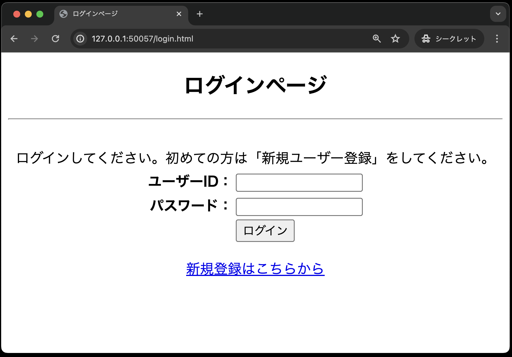
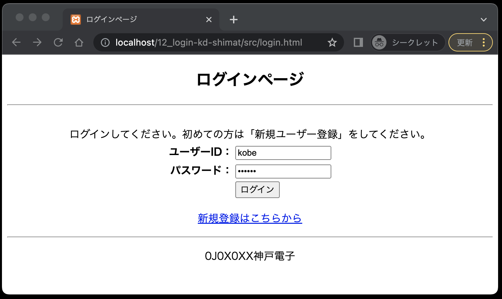
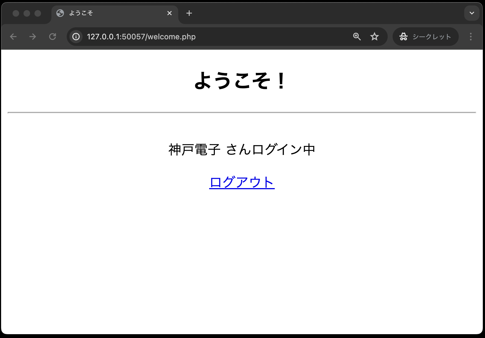
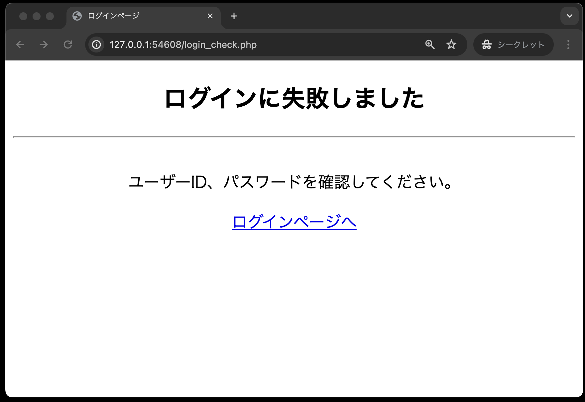

# ログイン認証(認証機能の実装)

前回のログイン認証(新規登録機能の実装)まで作成していれば、以下のファイル構成となっているはずです。

```text
public
├── classes
│   ├── dbdata.php
│   └── user.php
├── index.php
├── register.html
├── register.php
└── util.php
```

それでは、引き続きログイン認証のプログラムを実装していきましょう！
ここでは以下の4つを実装します。

1. `login.html`・・・ユーザーID、パスワードを入力する画面
1. `user.php`(認証用メソッド追加)・・・認証処理や新規ユーザの登録を行う
1. `login_check.php`・・・認証処理をする画面
1. `welcome.php`・・・ログイン認証が完了した場合、ログインしたユーザー名を表示する画面

## ログイン画面(login.html)

```php
<!DOCTYPE html>
<html lang="ja">

<head>
    <meta charset="UTF-8">
    <meta name="viewport" content="width=device-width, initial-scale=1.0">
    <title>ログインページ</title>
    <link rel="stylesheet" href="css/login.css">
</head>

<body>
    <div id="main">
        <h2>ログインページ</h2>
        <hr><br>
        ログインしてください。初めての方は「新規ユーザー登録」をしてください。
        <form method="POST" action="login_check.php">
            <table id="mainTable">
                <tr>
                    <th class="right-align">ユーザーID：</th>
                    <td class="left-align"><input type="text" name="userId" required></td>
                </tr>
                <tr>
                    <th class="right-align">パスワード：</th>
                    <td class="left-align"><input type="password" name="password" required></td>
                </tr>
                <tr>
                    <th>&nbsp;</th>
                    <td class="left-align"><input type="submit" value="ログイン"></td>
                </tr>
            </table>
        </form>
        <p><a href="register.html">新規登録はこちらから</a></p>
    </div>
</body>

</html>
```

入力が終わったら、必ずブラウザで以下のように正しく表示されるかを確認してください。


## Userクラスの認証用メソッド追加

前回は、クラス`User`に、新規ユーザー登録処理を行う`signUp`メソッドを追加しました。
今回は、ログイン認証処理を行う`authUser`メソッドを追加します。

ログイン認証を行うためには、ユーザーIDとパスワードを条件に、ユーザー情報を取得する必要があります。

**一部のソースコードが穴埋めになっている**ので、それぞれの箇所に適切なコードを追記してください。

**classes/user.php**

```php

// ================
// 前回作成部分は省略
// ================

// ログイン認証処理
public function authUser($userId, $password): array|false
{
    // SQL文を定義(穴埋め)
    // ※ヒント:ユーザーIDとパスワードを条件にユーザー情報を取得
    $sql = 
    // DbDataクラスのqueryメソッドを呼び出す
    $stmt = $this->query($sql, [$userId, $password]);
    // fetchメソッドでデータを取り出す(穴埋め)
    return 
}
```

## 認証処理画面(login_check.php)

まずは、認証処理画面(`login_check.php`)にて、ログインに成功した際、セッションに認証情報を保存します。

なお、**一部穴埋めになっている**ので、それぞれの箇所に適切なコードを追記してください。

```php
<?php
// 送られてきたデータの有効性をチェックする(穴埋め)
if (!isset($_POST['userId']) || !isset($_POST['password'])) {
    $error = '未入力の項目があります。<br>全ての項目を入力してください。';
}else{
    // 送られてきたユーザーIDとパスワードを受け取る(穴埋め)
    $userId   = 
    $password = 

    // Userクラスを利用するため、user.phpを読み込む(穴埋め)
    require_once 
    // UserクラスからUserオブジェクトを生成する(穴埋め)
    $user =  
    // authUserメソッドを呼び出し、認証結果を受け取る(穴埋め)
    $result = 

    // ログインに成功した場合、welcome.phpにリダイレクトする
    if ($result) {  // ①
        // セッションを開始(穴埋め)
        
        // セッションにユーザー名を保存
        $_SESSION['userName'] = $result['userName'];
        header('Location: welcome.php');
        exit();
    }
}
?>

<!DOCTYPE html>
<html lang="ja">

<head>
    <meta charset="UTF-8">
    <meta name="viewport" content="width=device-width, initial-scale=1.0">
    <title>ログインページ</title>
    <link rel="stylesheet" href="css/login.css">
</head>

<!-- ログインに失敗した場合のメッセージを表示する -->

<body>
    <div id="main">
        <h2><?= $error ?></h2>
        <hr><br>
        ユーザーID、パスワードを確認してください。
        <p><a href='login.html'>ログインページへ</a></p>
    </div>
</body>

</html>
```

**【解説】**

①`if ($result) {`: `$result`には`authUser`メソッドの戻り値が格納されます。
`authUser`の戻り値は、`fetch()`メソッドの戻り値になります。

`fetch()`メソッドの戻り値を`if`文の条件に使うと、データが取得できた場合は`true`、取得できなかった場合は`false`になります。

## 認証結果画面(welcome.php)

ログイン認証に成功し、ユーザーがログインしていることを表示する画面です。

なお、**一部穴埋めになっている**ので、それぞれの箇所に適切なコードを追記してください。

```php
<?php
// セッションを開始(穴埋め)

// 共通するデータ・関数を定義したPHPファイルを読み込む
require_once  __DIR__  .  '/util.php';
?>

<!DOCTYPE html>
<html lang="ja">

<head>
    <meta charset="UTF-8">
    <meta name="viewport" content="width=device-width, initial-scale=1.0">
    <title>ログインページ</title>
    <link rel="stylesheet" href="css/login.css">
</head>

<body>
    <div id="main">
        <h2>ようこそ！</h2>
        <hr><br>
        <!-- セッションに保存されたユーザー名を表示する(穴埋め) -->
        <?= h(                 ) ?>さんログイン中
        <p><a href='logout.php'>ログアウト</a></p>
    </div>
</body>

</html>
```

完成させた後、ブラウザで`login.html`を表示し、次のデータを入力後「ログイン」ボタンを押し、認証できることを確認してください。

- ユーザーID: kobe
- パスワード: denshi




また、登録していないユーザーを`login.html`に入力すると、以下のように認証が失敗することを確認してください。


