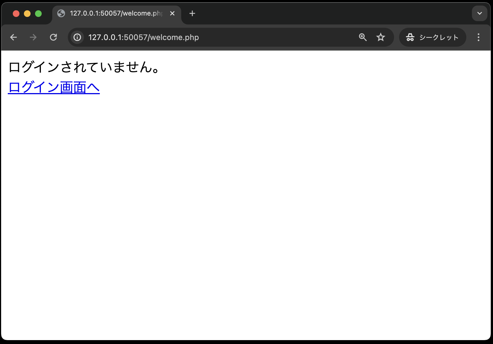

# ログイン認証(ログアウト機能と不正アクセス防止の実装)

ログイン認証(認証機能の実装)まで作成していれば、以下のファイル構成となっているはずです。

```text
public
├── classes
│   ├── dbdata.php
│   └── user.php
├── index.php
├── login_check.php
├── login.html
├── register.html
├── register.php
├── util.php
└── welcome.php
```

それでは、引き続きログイン認証のプログラムを実装していきましょう！

## ログアウト画面(logout.php)

ログアウト処理を行う`logout.php`を作成します。

なお、**一部穴埋めになっている**ので、それぞれの箇所に適切なコードを追記してください

```php
<?php
// セッションを開始(穴埋め)

// $_SESSIONの中身を空にする
$_SESSION = array();
// クッキーの中にセッションIDがある場合、クッキーの中身を空にする
// session_name()は、セッションIDが入っているクッキーの名前を取得する関数
if (isset($_COOKIE[session_name()]) == true) {  // ①
    setcookie(session_name(), '', time() - 10, '/');
}
// セッションに 関連づけられた全てのデータを破棄する(破棄タイミングは、PHPスクリプトが実行された後)
session_destroy();
?>

<!DOCTYPE html>
<html lang="ja">

<head>
    <meta charset="UTF-8">
    <meta name="viewport" content="width=device-width, initial-scale=1.0">
    <title>ログアウトページ</title>
    <link rel="stylesheet" href="css/login.css">
</head>

<body>
    <div id="main">
        <h2>ログアウトしました</h2>
        <hr><br>
        <p><a href="login.html">ログインページへ</a></p>
    </div>
</body>
```

## これでログイン認証作成完了！！...ではありません

このままですと、実はログインしていなくても、直接URLを入力することで認証結果画面(`welcome.php`)にアクセスすることができてしまいます...(もちろん、正しい画面遷移ではないのでエラーが出ます)



このような不正アクセスを防ぐために、ログインしていない場合はログインページに遷移をするよう処理を追加します。

## 認証処理画面(login_check.php)の修正

まずは、認証処理画面(`login_check.php`)にて、ログインに成功した際、セッションに認証情報を保存します。

```php
<?php
// ================
// 前回作成部分は省略
// ================

if ($result) { 
    // セッションを開始(穴埋め)
    
    // --以下を追加--
    $_SESSION['login'] = 1;　// ログインフラグ
    // --ここまで--

    // セッションにユーザー名を保存
    $_SESSION['userName'] = $result['userName'];
    header('Location: welcome.php');
    exit();
}

// ================
// 前回作成部分は省略
// ================
```

## 認証結果画面(welcome.php)の修正

続いて、認証結果画面(welcome.php)にて、セッションに認証情報が無い場合に、ログイン画面にリダイレクトする処理を追加します。

```php
<?php
// セッションを開始(穴埋め)

// ----以下を追加----
if (isset($_SESSION['login']) == false) {
    header('Location: login.html');
    exit();
}
// ----ここまで------

// 共通するデータ・関数を定義したPHPファイルを読み込む
require_once  __DIR__  .  '/util.php';
?>

// ================
// 前回作成部分は省略
// ================
```

以上で、修正は完了です。
実際の動作を確認してみましょう。

1. ログインしていない状態で、`welcome.php`にアクセスしてください。<br>


2. ログインページにリダイレクトされることを確認してください。


これでログイン認証の作成が完了しました。
お疲れ様でした。
